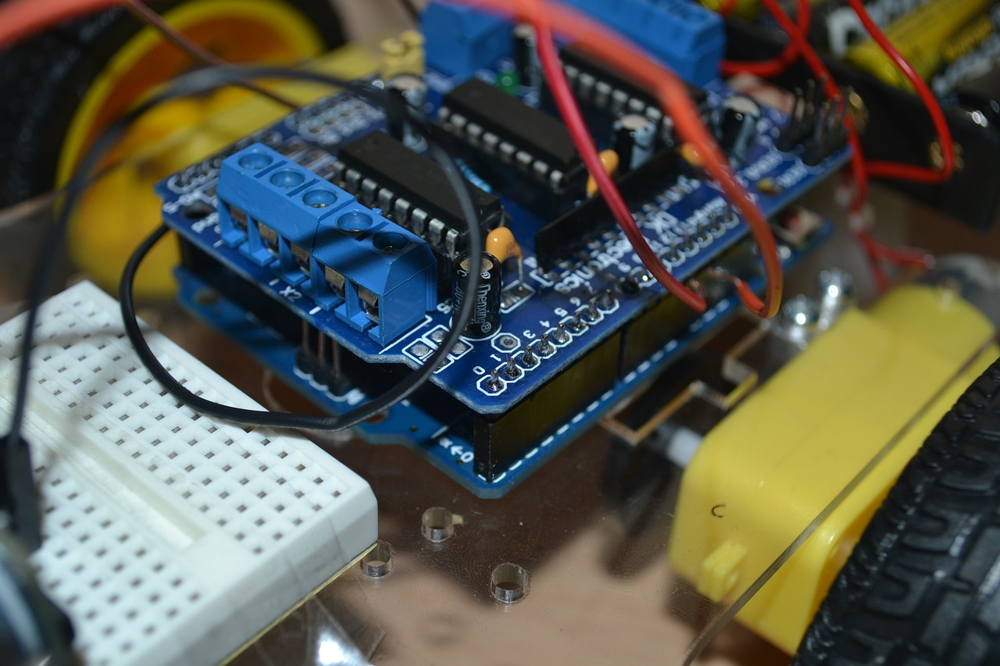
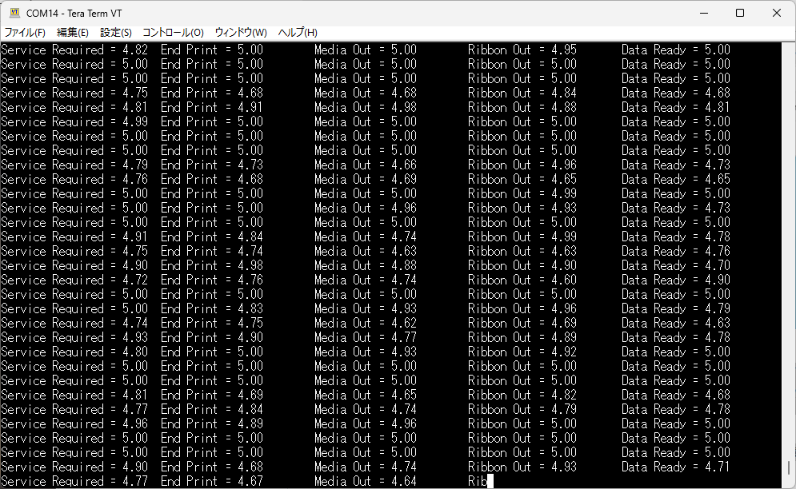

# Zebra-Printer_Guide to Get Printer Status with Audrino via Applicator Port

# Link-OS プリンタのプリンタステータス情報を収集する方法（Audrino編）

2024/08/15



<br>

印刷処理のオートメーション化が進む中で、PLCやマイコンでZebra Link-OS プリンタを制御する方法についてのお問い合わせが2023年下旬から増加している。本頁では産業用機器との連携方法を説明するにあたって、入手が容易な汎用マイコン（Arduino）を用いている。通信方式の中で最も基本的でお問い合わせの多いアプリケータポート経由によるステータス検知方法について説明をする。

**尚、ゼブラプリンタの設定方法やAudrinoの使用方法の詳細については冗長的になるため、割愛する。不明時は下記の参考資料リンクや各種マニュアルを参照すること。**

<br>

#### 最低限必要なもの

1. Zebra Link-OS プリンタ（Applicator Port必須*）
2. Arduino**
3. D-sub15ケーブル、コネクタ（プリンタとAudrino間を接続できるケーブルやコネクタ）***
4. その他（結線用ケーブル、ブレッドボード、基盤など状況に合わせて用意）***

<br>

\* 2024年8月現在、ZT6/ZT4/ZE5シリーズのみサポート  
\** 本項ではAudrino UNO を前提に説明  
\*** 環境に合わせて用意をすること  

※ プリンタ以外はAmazon、秋月電気、千石電商などの電子専門店で入手が可能。

<br>

#### ガイド

1. **[重要] Applicator 基盤のジャンパーピン設定を運用環境に合わせて設定する。**  
   プリンタや接続先機器の故障につながるため、関連ガイドに従って運用環境に合わせて適切な設定をすること。
2. プリンタの[Power Saving]を[OFF]に設定する。
3. [Applicator Port Mode]を[運用環境に合ったモード]に設定する。
4. Arduino とプリンタを結線する。本頁では下記結線を前提に説明を進める。

   | Arduino Uno | **Link-OS Printer** |
   | ----------- | ------------------------- |
   | Pin A0      | Applicator Port Pin 10    |
   | Pin A1      | Applicator Port Pin 11    |
   | Pin A2      | Applicator Port Pin 12    |
   | Pin A3      | Applicator Port Pin 13    |
   | Pin A4      | Applicator Port Pin 14    |
   | Pin GND     | Applicator Port Pin 1     |


   <br>
5. 下記コードをArduinoにインストールする。

   下記プログラムの概要は下記の通り。

   | データフロー              | 通信    | 機能                      |
   | ------------------------- | ------- | ------------------------- |
   | Arduino --> Zebra Printer | D-sub15 | 10-14ポートのデータを受信 |
   | Arduino                   | Serial  | 各ポート情報を表示        |


   <br>

   ```c++
    /*
    Link-OS プリンタのApplicator Outputデータを受信するデモプログラム
    */

    // These constants won't change. They're used to give names to the pins used:
    // Analog output pin that the LED is attached to applicator port

    const int analogInPin0 = A0;  // connected to applicator Pin 10
    const int analogInPin1 = A1;  // connected to applicator Pin 11
    const int analogInPin2 = A2;  // connected to applicator Pin 12
    const int analogInPin3 = A3;  // connected to applicator Pin 13
    const int analogInPin4 = A4;  // connected to applicator Pin 14

    // Initilize sensor values
    int sensorValue0 = 0;      
    int sensorValue1 = 0;      
    int sensorValue2 = 0;      
    int sensorValue3 = 0;      
    int sensorValue4 = 0;      

    // value output to the PWM (analog out)
    // int outputValue = 0;      

    // Values convert input sensor values
    float inputVoltage0 = 0.00;
    float inputVoltage1 = 0.00;
    float inputVoltage2 = 0.00;
    float inputVoltage3 = 0.00;
    float inputVoltage4 = 0.00;

    void setup() {

    // initialize serial communications at 9600 bps:
    Serial.begin(9600);
    }

    void loop() {

    // read the analog inputs in value:
    sensorValue0 = analogRead(analogInPin0);
    sensorValue1 = analogRead(analogInPin1);
    sensorValue2 = analogRead(analogInPin2);
    sensorValue3 = analogRead(analogInPin3);
    sensorValue4 = analogRead(analogInPin4);


    // map it to the range of the analog out:
    // outputValue = map(sensorValue, 0, 1023, 0, 255);

    // change the analog out value:
    // analogWrite(A5, 255);

    /*
    // Serial logging in sensor values
    Serial.print("Service Required = ");
    Serial.print(sensorValue0);
    Serial.print("\t End Print = ");
    Serial.print(sensorValue1);
    Serial.print("\t Media Out = ");
    Serial.print(sensorValue2);
    Serial.print("\t Ribbon Out = ");
    Serial.print(sensorValue3);
    Serial.print("\t Data Ready = ");
    Serial.println(sensorValue4);
    */

    // Convert sensor values to volts
    inputVoltage0 = (float)sensorValue0 * 5 / 1023;
    inputVoltage1 = (float)sensorValue1 * 5 / 1023;
    inputVoltage2 = (float)sensorValue2 * 5 / 1023;
    inputVoltage3 = (float)sensorValue3 * 5 / 1023;
    inputVoltage4 = (float)sensorValue4 * 5 / 1023;

    // Serial logging in volts
    Serial.print("Service Required = ");
    Serial.print(inputVoltage0);
    Serial.print("\t End Print = ");
    Serial.print(inputVoltage1);
    Serial.print("\t Media Out = ");
    Serial.print(inputVoltage2);
    Serial.print("\t Ribbon Out = ");
    Serial.print(inputVoltage3);
    Serial.print("\t Data Ready = ");
    Serial.println(inputVoltage4);

    delay(100);
    }

   ```

   <br>

   ##### 受信データ例

   ```
   Service Required = 5.00  End Print = 5.00        Media Out = 5.00        Ribbon Out = 5.00       Data Ready = 5.00
    Service Required = 4.75  End Print = 4.79        Media Out = 4.70        Ribbon Out = 4.75       Data Ready = 4.83
    Service Required = 4.76  End Print = 4.81        Media Out = 4.74        Ribbon Out = 4.71       Data Ready = 4.69
    Service Required = 4.95  End Print = 5.00        Media Out = 5.00        Ribbon Out = 5.00       Data Ready = 5.00
    Service Required = 5.00  End Print = 5.00        Media Out = 5.00        Ribbon Out = 5.00       Data Ready = 5.00
   ```

   

<br>

#### 参考資料リンク

- [Applicator Portとはなにか？仕組みと活用場所を理解](https://github.com/shimauma-giken/Zebra-Printer-Link-OS_Understanding-Logic-of-Applicator-Port)

<br>

<br>

Enjoy Zebra!!

<br>
